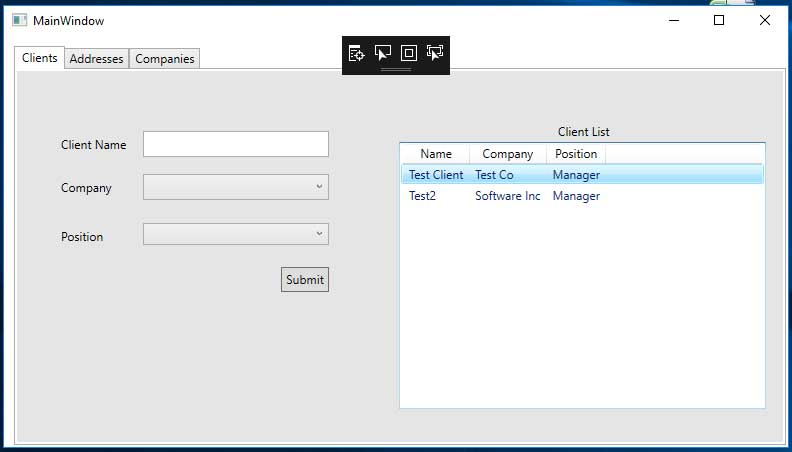
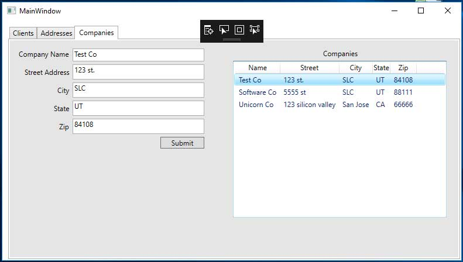
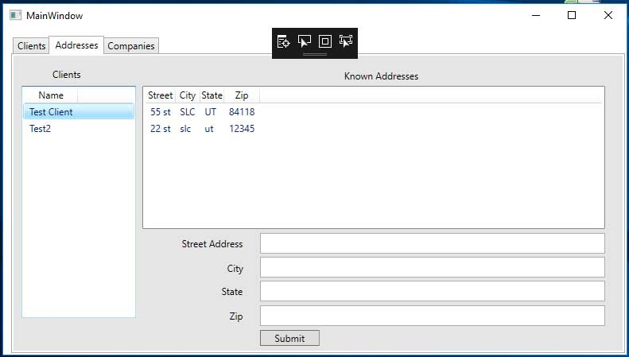
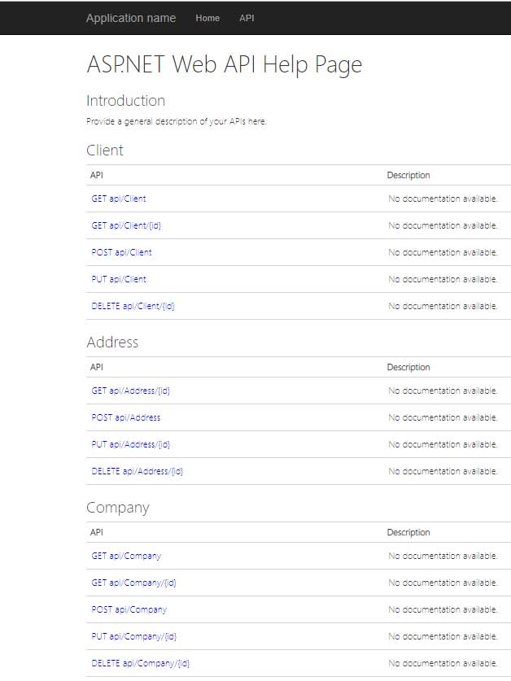

# C# Final Project Summer 2018
## <a href="https://github.com/chardur/c-FinalSummer18/">link to source code</a>
Client management app. Based on the MVVM software architectural pattern for enterprise level scalability.
The user interface (Assignment3Conv) has 3 view models; one for the Client tab, one for the address tab, and one for the company tab.
The project uses an ASP.NET web api (WebApi) for Create, read, update and delete (CRUD).
The project uses Entity framework 6 for data persistence (DataLayer).

